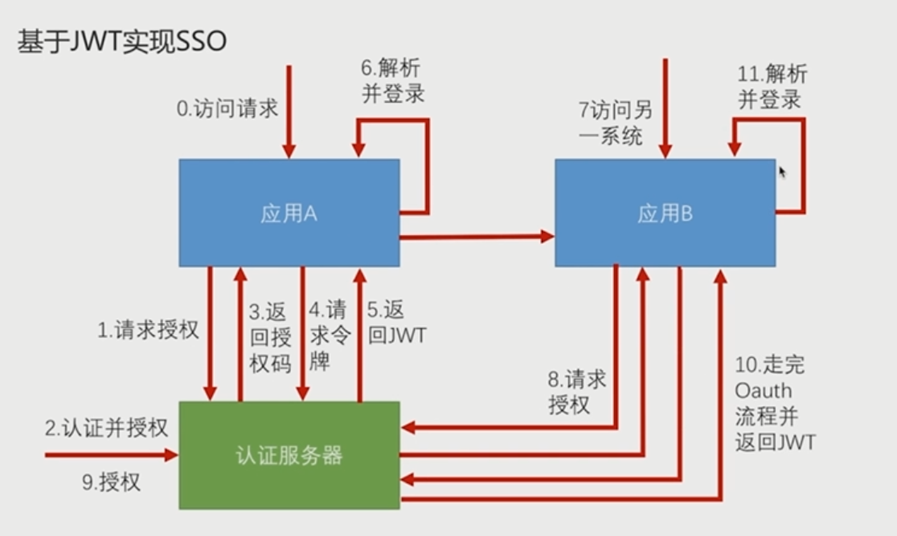
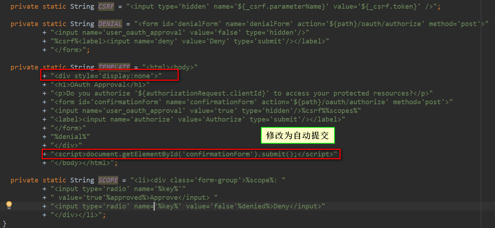

#### 基于JWT的SSO实现


##### 重写WhitelabelApprovalEndpoint

* 修改截图


    ```java
    package com.jhon.rain.sso.server;
    
    import org.springframework.web.bind.annotation.RequestMapping;
    import org.springframework.web.bind.annotation.RestController;
    import org.springframework.web.bind.annotation.SessionAttributes;
    import org.springframework.web.servlet.ModelAndView;
    
    import javax.servlet.http.HttpServletRequest;
    import java.util.Map;
    
    /**
     * <p>功能描述</br> 重写</p>
     *
     * @author jiangy19
     * @version v1.0
     * @FileName SSOApprovalEndpoint
     * @date 2017/10/29 15:07
     */
    @RestController
    @SessionAttributes("authorizationRequest")
    public class SSOApprovalEndpoint {
    
        @RequestMapping("/oauth/confirm_access")
        public ModelAndView getAccessConfirmation(Map<String, Object> model, HttpServletRequest request) throws Exception {
            String template = createTemplate(model, request);
            if (request.getAttribute("_csrf") != null) {
                model.put("_csrf", request.getAttribute("_csrf"));
            }
            return new ModelAndView(new SSOSpelView(template), model);
        }
    
        protected String createTemplate(Map<String, Object> model, HttpServletRequest request) {
            String template = TEMPLATE;
            if (model.containsKey("scopes") || request.getAttribute("scopes") != null) {
                template = template.replace("%scopes%", createScopes(model, request)).replace("%denial%", "");
            } else {
                template = template.replace("%scopes%", "").replace("%denial%", DENIAL);
            }
            if (model.containsKey("_csrf") || request.getAttribute("_csrf") != null) {
                template = template.replace("%csrf%", CSRF);
            } else {
                template = template.replace("%csrf%", "");
            }
            return template;
        }
    
        private CharSequence createScopes(Map<String, Object> model, HttpServletRequest request) {
            StringBuilder builder = new StringBuilder("<ul>");
            @SuppressWarnings("unchecked")
            Map<String, String> scopes = (Map<String, String>) (model.containsKey("scopes") ? model.get("scopes") : request
                            .getAttribute("scopes"));
            for (String scope : scopes.keySet()) {
                String approved = "true".equals(scopes.get(scope)) ? " checked" : "";
                String denied = !"true".equals(scopes.get(scope)) ? " checked" : "";
                String value = SCOPE.replace("%scope%", scope).replace("%key%", scope).replace("%approved%", approved)
                                .replace("%denied%", denied);
                builder.append(value);
            }
            builder.append("</ul>");
            return builder.toString();
        }
    
        private static String CSRF = "<input type='hidden' name='${_csrf.parameterName}' value='${_csrf.token}' />";
    
        private static String DENIAL = "<form id='denialForm' name='denialForm' action='${path}/oauth/authorize' method='post'><input name='user_oauth_approval' value='false' type='hidden'/>%csrf%<label><input name='deny' value='Deny' type='submit'/></label></form>";
    
        private static String TEMPLATE = "<html><body>"
                        + "<div style='display:none'>"
                        + "<h1>OAuth Approval</h1>"
                        + "<p>Do you authorize '${authorizationRequest.clientId}' to access your protected resources?</p>"
                        + "<form id='confirmationForm' name='confirmationForm' action='${path}/oauth/authorize' method='post'><input name='user_oauth_approval' value='true' type='hidden'/>%csrf%%scopes%<label><input name='authorize' value='Authorize' type='submit'/></label></form>"
                        + "%denial%"
                        + "</div>"
                        + "<script>document.getElementById('confirmationForm').submit();</script>"
                        + "</body></html>";
    
        private static String SCOPE = "<li><div class='form-group'>%scope%: <input type='radio' name='%key%'"
                        + " value='true'%approved%>Approve</input> <input type='radio' name='%key%' value='false'%denied%>Deny</input></div></li>";
    
    }
    ```